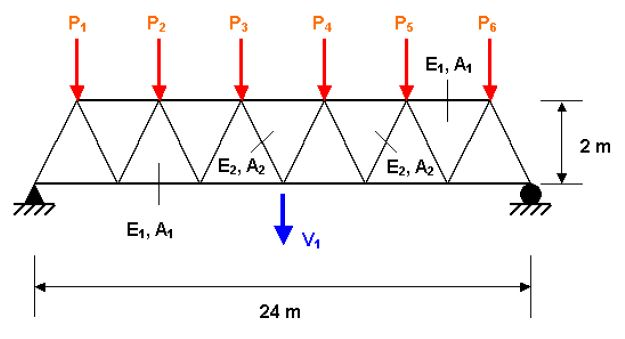
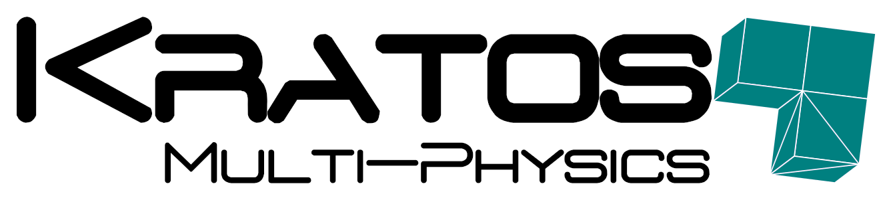

# The sudret truss example

The **sudret truss** example analyses a 3D truss with 23 elastic bars under 6 vertical loads P1 to P6. [[1]](#1).

### Dependencies 

[Kratos multiphysics ](https://github.com/KratosMultiphysics/Kratos)
KRATOS Multiphysics ("Kratos") is a framework for building parallel, multi-disciplinary simulation software, aiming at modularity, extensibility, and high performance. Kratos is written in C++, and counts with an extensive Python interface

## References
<a id="1">[1]</a> 
Sudret, B. (2007). 
Uncertainty propagation and sensitivity analysis in mechanical models–Contributions to structural reliability and stochastic spectral methods. 
Habilitationa diriger des recherches, Université Blaise Pascal, Clermont-Ferrand, France, 147, 53.